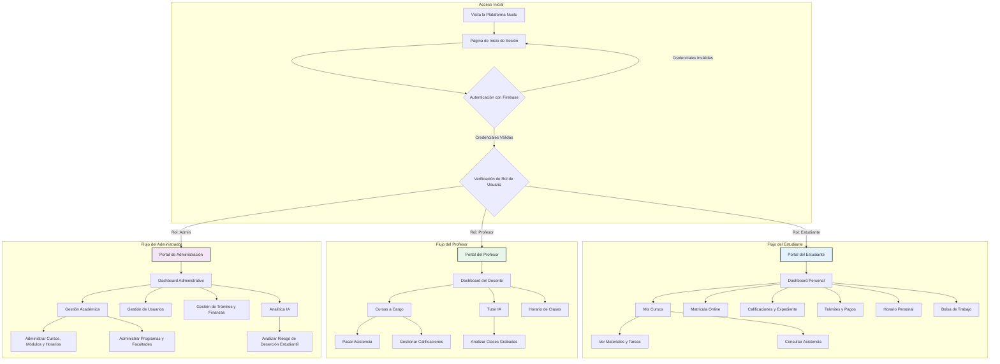

# Diagrama de Flujo de la Plataforma Nuxtu

Este documento ilustra el flujo de usuario y la arquitectura de la aplicación "Nuxtu" para los diferentes roles: Estudiante, Profesor y Administrador.

```mermaid
graph TD
    subgraph "Acceso Inicial"
        A[Visita la Plataforma Nuxtu] --> B[Página de Inicio de Sesión];
        B --> C{Autenticación con Firebase};
        C -- Credenciales Válidas --> D{Verificación de Rol de Usuario};
        C -- Credenciales Inválidas --> B;
    end

    D --> |Rol: Estudiante| E[Portal del Estudiante];
    D --> |Rol: Profesor| F[Portal del Profesor];
    D --> |Rol: Admin| G[Portal de Administración];

    subgraph "Flujo del Estudiante"
        direction LR
        E --> E1[Dashboard Personal];
        E1 --> E2[Mis Cursos];
        E1 --> E3[Matrícula Online];
        E1 --> E4[Calificaciones y Expediente];
        E1 --> E5[Trámites y Pagos];
        E1 --> E6[Horario Personal];
        E1 --> E7[Bolsa de Trabajo];
        E2 --> E2a[Ver Materiales y Tareas];
        E2 --> E2b[Consultar Asistencia];
    end

    subgraph "Flujo del Profesor"
        direction LR
        F --> F1[Dashboard del Docente];
        F1 --> F2[Cursos a Cargo];
        F1 --> F3[Tutor IA];
        F1 --> F4[Horario de Clases];
        F2 --> F2a[Pasar Asistencia];
        F2 --> F2b[Gestionar Calificaciones];
        F3 --> F3a[Analizar Clases Grabadas];
    end

    subgraph "Flujo del Administrador"
        direction LR
        G --> G1[Dashboard Administrativo];
        G1 --> G2[Gestión Académica];
        G1 --> G3[Gestión de Usuarios];
        G1 --> G4[Gestión de Trámites y Finanzas];
        G1 --> G5[Analítica IA];
        G2 --> G2a[Administrar Cursos, Módulos y Horarios];
        G2 --> G2b[Administrar Programas y Facultades];
        G5 --> G5a[Analizar Riesgo de Deserción Estudiantil];
    end

    style E fill:#e3f2fd,stroke:#333,stroke-width:2px
    style F fill:#e8f5e9,stroke:#333,stroke-width:2px
    style G fill:#f3e5f5,stroke:#333,stroke-width:2px
```
